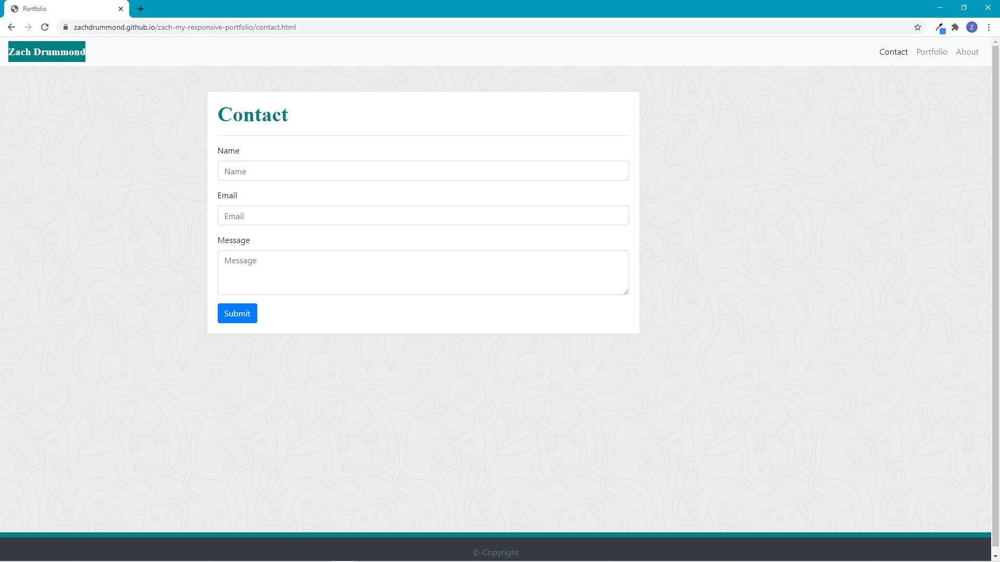
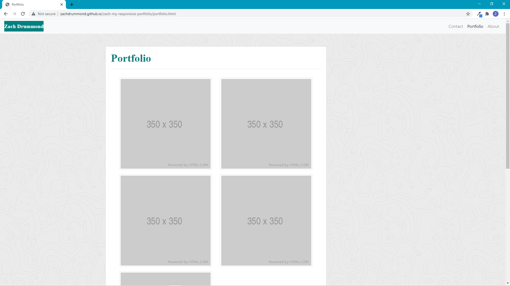

# My Responsive Portfolio - Update #1

## Table of Contents
* [Description](#Description)
* [Design Elements](#Design-Elements)
* [Pages Preview](#Pages-Preview)
* [Links](#Links)
* [Credits](#Credits)

## Description
This is update #1 to my responsive portfolio. I designed this website in such a way that it would render well on a variety of devices and screen sizes. I hope to be able to use this website one day to showcase all of my web applications, provide a basic profile of me, and give others a place to contact me.

I tried to build this website by implementing only Bootstrap classes as much as I could.

## Design Elements
### *Bootstrap*
* Grid System
* Functional Navigation Bar with Button
* Responsive Layout
* Contact Card
* Forms
* Responsive Images
* Footer
* Borders
* Sizing
* Spacing
* Colors
* Text Alignment & Wrapping

### *HTML*
* Logical Structure
* Sequential Order
* Consistency across each HTML File
* Bootstrap CSS Link
* Bootstrap JavaScript Link
* CSS File Link
* Concise Descriptive Title
* Semantic Elements
* ids, Classes, and Elements
* Accessible Attributes
* Comments

### *CSS*
* Background Image
* Border
* Float
* Padding & Margin
* Font
* Colors
* Comments

## Pages Preview
### *Contact*

### *Portfolio*

### *About*

## Links
* Website: https://zachdrummond.github.io/zach-my-responsive-portfolio/contact.html
* GitHub Repository: https://github.com/zachdrummond/zach-my-responsive-portfolio

## Credits
* Bootstrap: https://getbootstrap.com/