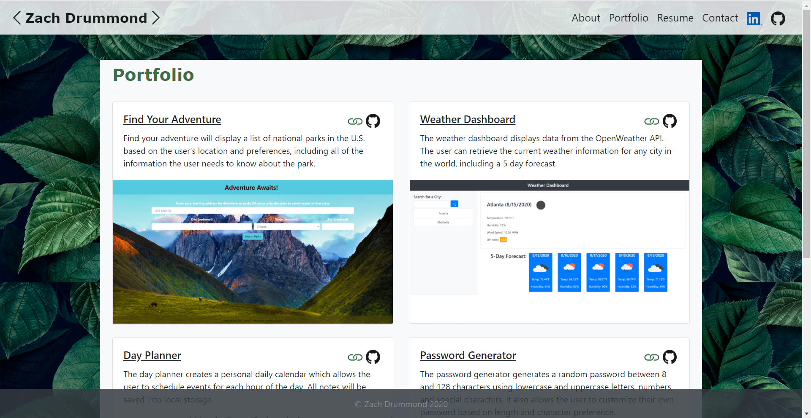

# My Responsive Portfolio - Update #1

# Updates
* Added LinkedIn & GitHub Links
* Changed Navbar Headers
* Changed background image
* Removed line above footer
* Changed font and font-color
* Changed card color
* Added icons

## Table of Contents
* [Description](#Description)
* [Links](#Links)
* [Design Elements](#Design-Elements)
* [Pages Preview](#Pages-Preview)
* [Credits](#Credits)

## Description
This is update #1 to my responsive portfolio. I designed this website in such a way that it would render well on a variety of devices and screen sizes. I hope to be able to use this website one day to showcase all of my web applications, provide a basic profile of me, and give others a place to contact me.

## Links
* Website: https://zachdrummond.github.io/portfolio-update-1/
* GitHub Repository: https://github.com/zachdrummond/portfolio-update-1

## Design Elements
### *Bootstrap*
* Grid System
* Functional Navigation Bar with Button
* Responsive Layout
* Contact Card
* Forms
* Responsive Images
* Footer
* Borders
* Sizing
* Spacing
* Colors
* Text Alignment & Wrapping

### *HTML*
* Logical Structure
* Sequential Order
* Consistency across each HTML File
* Bootstrap CSS Link
* Bootstrap JavaScript Link
* CSS File Link
* Concise Descriptive Title
* Semantic Elements
* ids, Classes, and Elements
* Accessible Attributes
* Comments

### *CSS*
* Background Image
* Border
* Float
* Padding & Margin
* Font
* Colors
* Comments

## Pages Preview
### *About*

### *Portfolio*

### *Contact*

## Credits
* Bootstrap: https://getbootstrap.com/

## Updated GitHub Profile

8. README files. Every pinned project should contain a README file with:

   * Title of app
   * Live link to deployed app
   * List of technologies used
   * 1-2 sentences explaining what the app is
   * 2-3 Screenshots / gifs of the app
   * License (usually MIT)
   * Contact information for you and any collaborators

9. Commit history. Every pinned repository should have at least 20 commits

### 4. Updated LinkedIn Profile

💁 Need help updating your LinkedIn? Check out the [Career Services milestone resources for online presence](https://sites.google.com/2u.com/careerservices-webdev/coding-milestones/milestone-polish-online-presence).

Update your LinkedIn Profile with a strong bio statement, a professional photo, and links to your Github and portfolio.

### ⭐ 5. For Job-Seeking Students (BONUS)

If you are a job-seeking student, then getting yourself marked as employer-ready is an important step to take because you'll get:

* added to our employer referral list where we'll help match you with employers for int`erviews

* exclusive access to workshops for employer-ready students

* a statistically higher success rate in your job search

So if you are going to be looking for a job at the end of bootcamp, go ahead and submit these updated items to your Career Materials Advisor (formerly, Profile Coach) via BootcampSpot.
